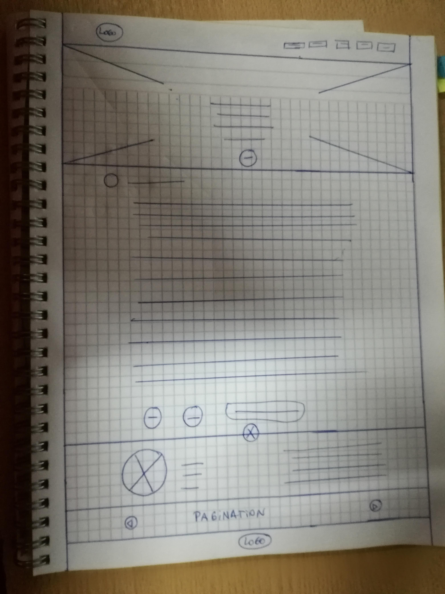
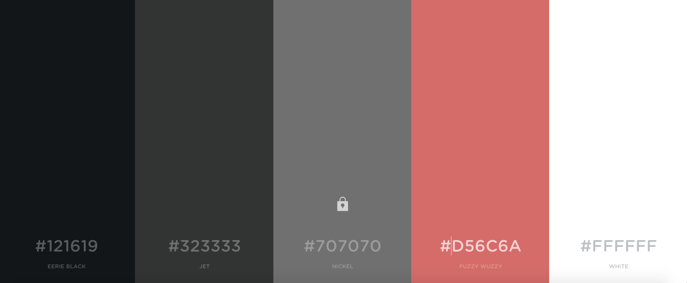

Premaketado Barberia

para la página usaremos el siguiente diseño
 

para el celular el siguiente diseño
 

los colores para el diseño son
para el celular el siguiente diseño
 

los estilos a utilizar son:
PlayfairDisplay-Blackltalic
PlayfairDisplay-Regular
Roboto-Regular
Roboto-Light

La página deberá contendrá

	 Una barra de navegación con logo:
navbar
	<!-- Image and text -->
	<nav class="navbar navbar-light bg-light">
	<a class="navbar-brand" href="#">
    
    Bootstrap
	</a>
	</nav>
nav
	<ul class="nav justify-content-end">
	<li class="nav-item">
    <a class="nav-link active" href="#">Active</a>
	</li>
	<li class="nav-item">
    <a class="nav-link" href="#">Link</a>
	</li>
	<li class="nav-item">
    <a class="nav-link" href="#">Link</a>
	</li>
	<li class="nav-item">
    <a class="nav-link disabled" href="#">Disabled</a>
	</li>
	</ul>

		Un header con un jumbotron, con boton
Jumbotron
	

	  <h1 class="display-4">Hello, world!</h1>
	  
This is a simple hero unit, a simple jumbotron-style component for calling extra attention to featured content or information.

	

	
It uses utility classes for typography and spacing to space content out within the larger container.

	<a class="btn btn-primary btn-lg" href="#" role="button">Learn more</a>
	

con una imagen de fondo

    
		Una entrada con un container con parrafos 
	

	

	

	

	

     
	Un footer

con la firma en la que ira el perfil del autor del artículo en grillas
	

	

    

      1 of 2
    

    

      2 of 2
    

	

con una imagen del autor

con margen redondo
	
y parrafo 
	

 		
	 Una barra con flechas que permitan ir a las entradas anteriores y siguientes

	<nav aria-label="Page navigation example">
	<ul class="pagination">
    <li class="page-item"><a class="page-link" href="#">Previous</a></li>
    <li class="page-item"><a class="page-link" href="#">1</a></li>
    <li class="page-item"><a class="page-link" href="#">2</a></li>
    <li class="page-item"><a class="page-link" href="#">3</a></li>
    <li class="page-item"><a class="page-link" href="#">Next</a></li>
	</ul>
	</nav>
	
un jumbotron con el logo
	

	

    <h1 class="display-4">Fluid jumbotron</h1>
    
This is a modified jumbotron that occupies the entire horizontal space of its parent.

	

	

Recuerda que la página web deberá ser responsiva. Toma como referencia el siguiente [mockup](img/barbershop-mobile.png) con la versión móvil.

### Criterios de evaluación:

- Uso de dependencias específicas para la página web
- Utilización de BEM en clases CSS
- Buenas prácticas y uso de identado correcto
- Uso de media queries
- Uso de GIT para versionar el desafío
- Uso de Github Pages
- Creación del repositorio con el desafío
- Creación de README.md con link de página web subida a Github Pages
